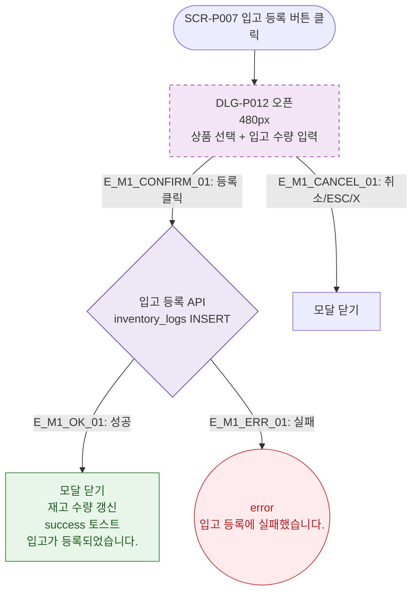

# M1 모달 생명주기 — DLG-P012 입고 등록 🆕

## 다이어그램

## TC 후보

| TC ID | 타입 | Given | When | Then |
|-------|------|-------|------|------|
| TC-DLG-P012-M1-01 | positive | 유효한 입고 정보 | 등록 클릭 | 모달 닫힘, 재고 갱신, success 토스트 |
| TC-DLG-P012-M1-02 | negative | API 실패 | 등록 클릭 | error 토스트, 모달 유지 |
