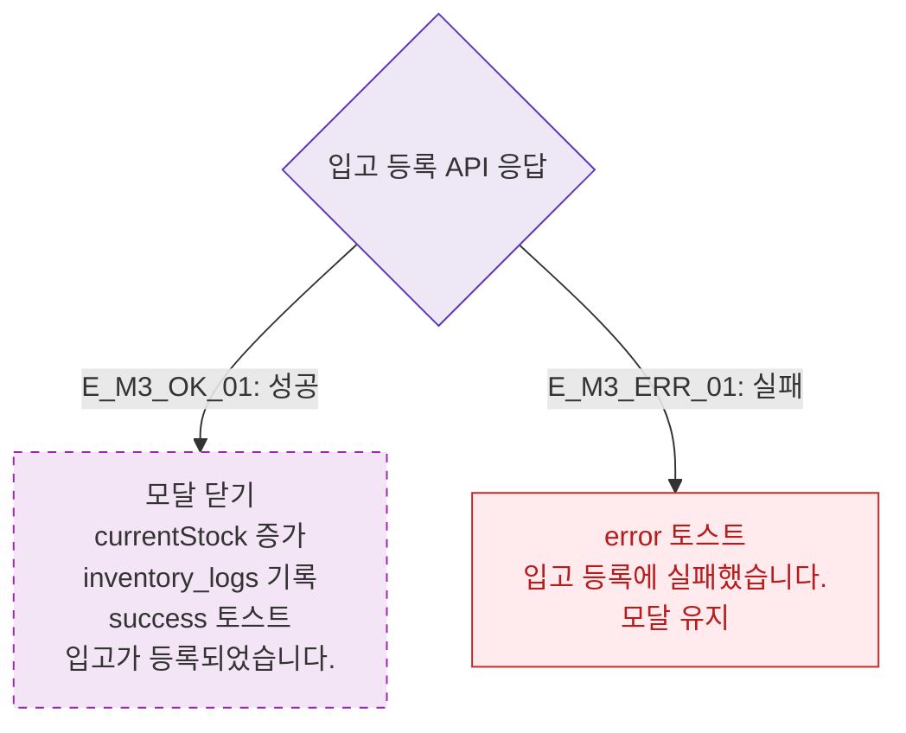

# M3 결과 분기 — DLG-P012 입고 등록 🆕

## 다이어그램

## TC 후보

| TC ID | 타입 | Given | When | Then |
|-------|------|-------|------|------|
| TC-DLG-P012-M3-01 | positive | 입고 등록 성공 | API 201 | 재고 증가, inventory_logs 기록, success 토스트 |
| TC-DLG-P012-M3-02 | negative | API 실패 | 등록 클릭 | error 토스트, 모달 유지 |
