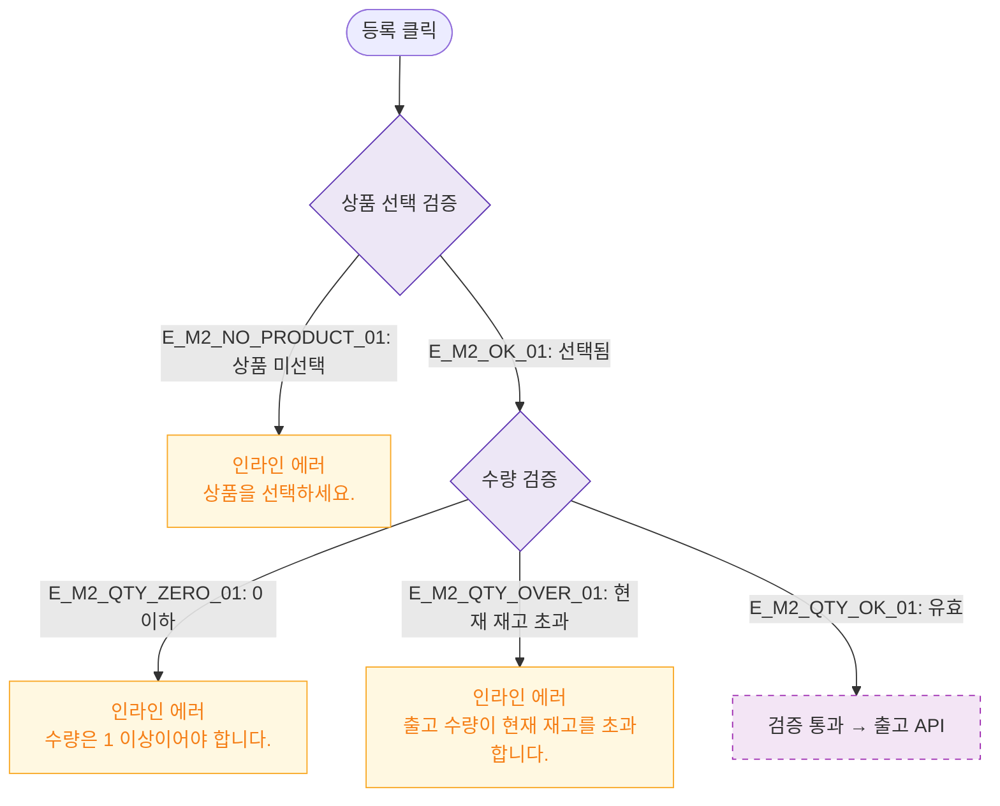

# M2 필드 검증 — DLG-P013 출고 등록 🆕

## 다이어그램

## TC 후보

| TC ID | 타입 | Given | When | Then |
|-------|------|-------|------|------|
| TC-DLG-P013-M2-01 | negative | 수량 0 | 등록 클릭 | 인라인 에러 "1 이상이어야 합니다." |
| TC-DLG-P013-M2-02 | negative | 출고량 > 현재 재고 | 등록 클릭 | 인라인 에러 "현재 재고 초과" |
