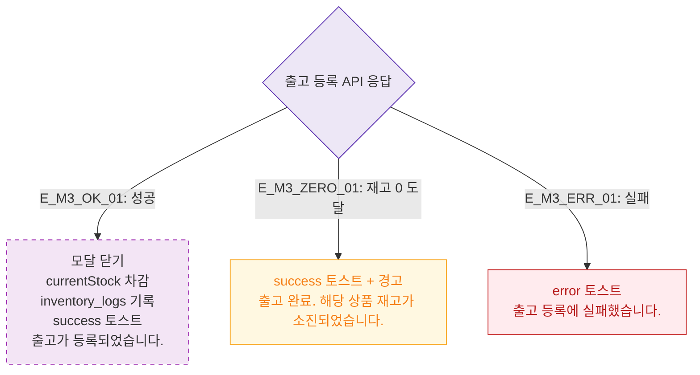

# M3 결과 분기 — DLG-P013 출고 등록 🆕

## 다이어그램

## TC 후보

| TC ID | 타입 | Given | When | Then |
|-------|------|-------|------|------|
| TC-DLG-P013-M3-01 | positive | 출고 등록 성공 | API 201 | 재고 차감, inventory_logs 기록 |
| TC-DLG-P013-M3-02 | positive | 출고 후 재고 0 | API 성공 | success 토스트 + "재고 소진" 경고 |
| TC-DLG-P013-M3-03 | negative | API 실패 | 등록 클릭 | error 토스트 |
