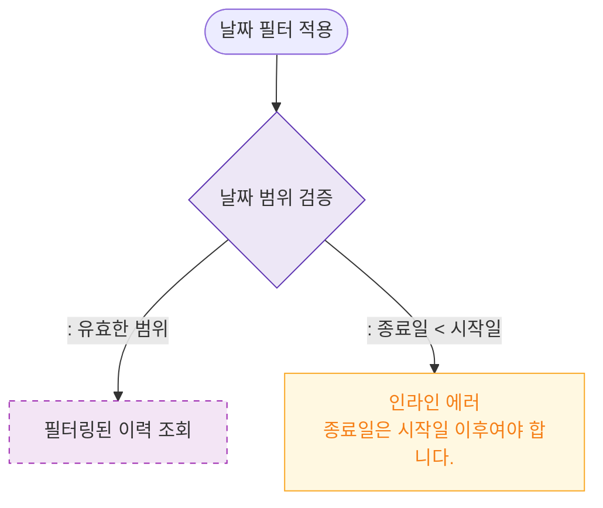

# M2 필드 검증 — DLG-P015 입출고 이력 🆕

## 다이어그램

## TC 후보

| TC ID | 타입 | Given | When | Then | |-------|------|-------|------|------| | TC-DLG-P015-M2-01 | negative | 종료일 < 시작일 | 필터 적용 | 인라인 에러 "종료일은 시작일 이후" |
