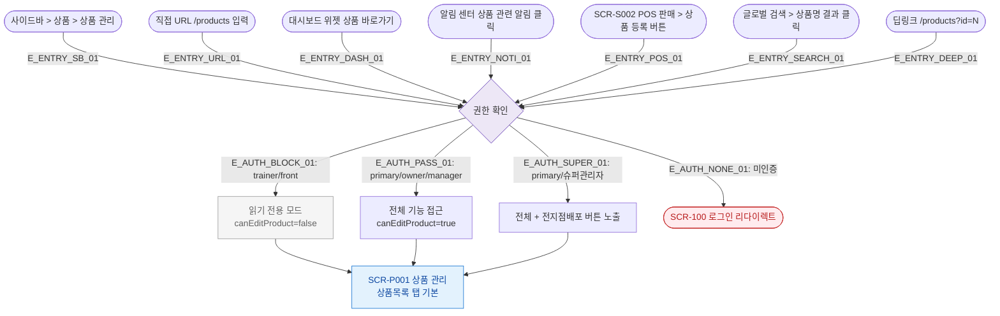

# F1 진입 플로우 — SCR-P001 상품 관리

## 목적
상품 관리 화면(/products)으로 진입할 수 있는 모든 경로를 정의한다.

## 전제조건
- 사용자가 CRM에 로그인된 상태
- 세션 유효

## 다이어그램

## 엣지 설명

| 엣지 ID | 출발 | 도착 | 조건 |
|---------|------|------|------|
| E_ENTRY_SB_01 | 사이드바 | 권한확인 | 사이드바 메뉴 클릭 |
| E_ENTRY_URL_01 | URL 직접입력 | 권한확인 | /products 진입 |
| E_ENTRY_DASH_01 | 대시보드 | 권한확인 | 위젯 클릭 |
| E_ENTRY_NOTI_01 | 알림센터 | 권한확인 | 상품 알림 클릭 |
| E_ENTRY_POS_01 | POS | 권한확인 | 상품 등록 버튼 |
| E_ENTRY_SEARCH_01 | 글로벌검색 | 권한확인 | 검색 결과 클릭 |
| E_ENTRY_DEEP_01 | 딥링크 | 권한확인 | URL 파라미터 포함 |
| E_AUTH_BLOCK_01 | 권한확인 | 읽기전용 | trainer/front 역할 |
| E_AUTH_PASS_01 | 권한확인 | 전체접근 | manager 이상 |
| E_AUTH_SUPER_01 | 권한확인 | 슈퍼접근 | 슈퍼관리자 |
| E_AUTH_NONE_01 | 권한확인 | 로그인 | 미인증 |

## TC 후보

| TC ID | 타입 | Given | When | Then |
|-------|------|-------|------|------|
| TC-P001-F1-01 | positive | 매니저 로그인 | 사이드바 상품 관리 클릭 | /products 진입, canEditProduct=true |
| TC-P001-F1-02 | positive | trainer 로그인 | 사이드바 상품 관리 클릭 | 읽기 전용, 등록 버튼 숨김 |
| TC-P001-F1-03 | negative | 미인증 | /products URL 직접 입력 | 로그인 화면으로 리다이렉트 |
