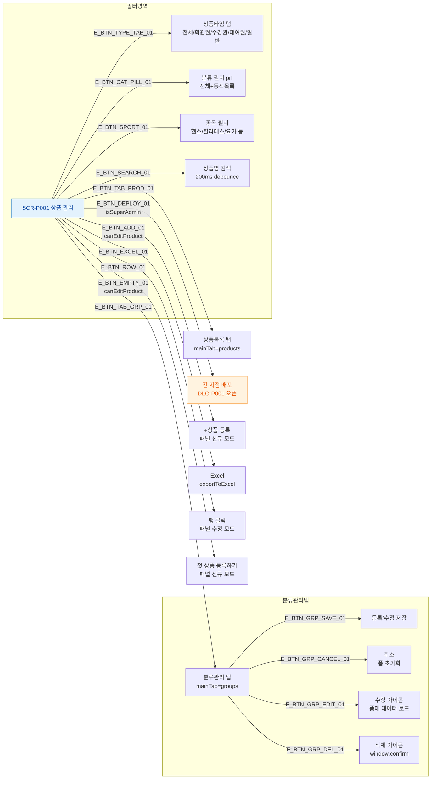

# F3 버튼/액션 매핑 플로우 — SCR-P001 상품 관리

## 목적
SCR-P001에 존재하는 모든 버튼과 각 동작을 노드화한다.

## 다이어그램

## TC 후보

| TC ID | 타입 | Given | When | Then |
|-------|------|-------|------|------|
| TC-P001-F3-01 | positive | isSuperAdmin=false | 전지점 배포 버튼 확인 | 버튼 숨김 |
| TC-P001-F3-02 | positive | canEditProduct=false | +상품 등록 버튼 확인 | 버튼 숨김 |
| TC-P001-F3-03 | positive | 분류관리 탭 | 분류 삭제 아이콘 클릭 | window.confirm 표시 |
