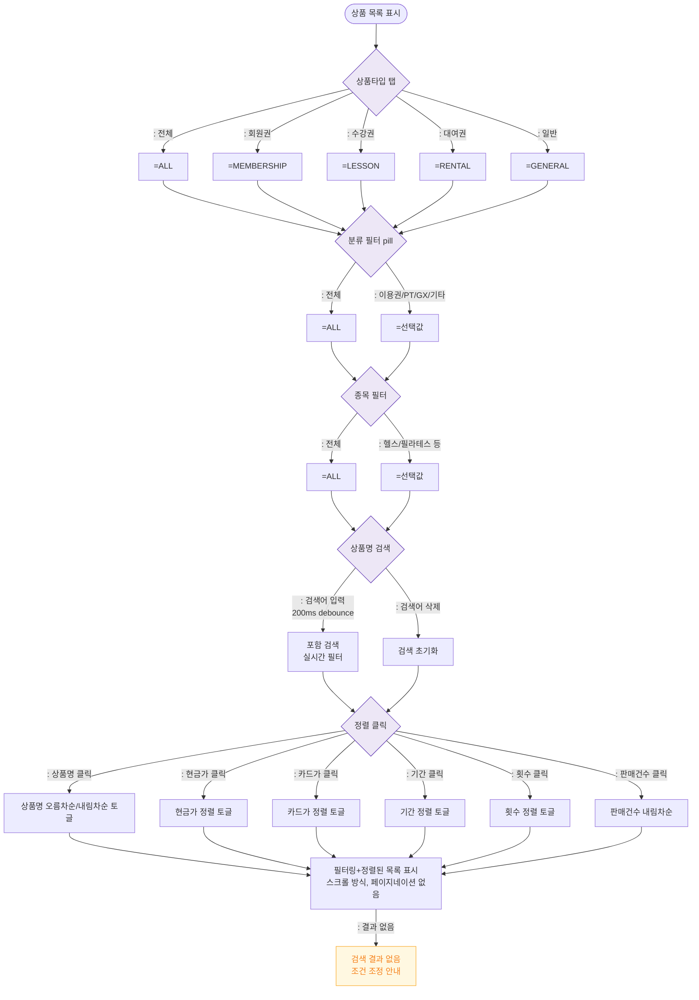

# F4 필터/검색/정렬 플로우 — SCR-P001 상품 관리

## 목적
필터 조합, 검색, 정렬 조작에 따른 상품 목록 갱신 흐름을 정의한다. 가격 이력/할인 중첩/재고 차감 참조는 F8에서 상세화.

## 다이어그램

## TC 후보

| TC ID | 타입 | Given | When | Then | |-------|------|-------|------|------| | TC-P001-F4-01 | positive | 상품 목록 | 회원권 탭 클릭 | MEMBERSHIP 타입만 표시 | | TC-P001-F4-02 | positive | 전체 목록 | "PT" 분류 pill 클릭 | PT 카테고리 상품만 표시 | | TC-P001-F4-03 | positive | 목록 존재 | "헬스" 검색 입력 | 상품명에 "헬스" 포함된 항목만 표시 | | TC-P001-F4-04 | positive | 목록 존재 | 현금가 컬럼 클릭 | 현금가 오름차순 정렬 |
