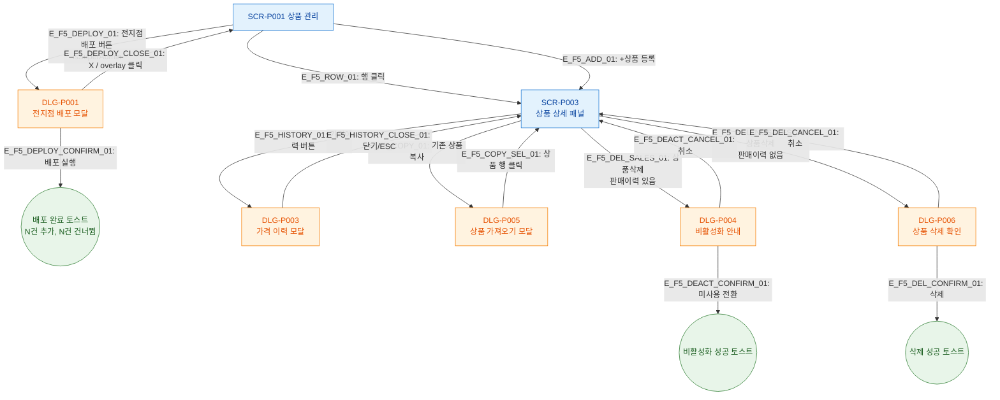

# F5 모달 트리거 트리 — SCR-P001 상품 관리

## 목적
SCR-P001에서 직접/간접으로 트리거되는 모든 모달과 하위 모달 연결을 정의한다.

## 다이어그램

## TC 후보

| TC ID | 타입 | Given | When | Then |
|-------|------|-------|------|------|
| TC-P001-F5-01 | positive | 슈퍼관리자 | 전지점 배포 클릭 | DLG-P001 모달 오픈 |
| TC-P001-F5-02 | positive | 판매이력 있는 상품 | 상품삭제 클릭 | DLG-P004 비활성화 안내 표시 |
| TC-P001-F5-03 | positive | 판매이력 없는 상품 | 상품삭제 클릭 | DLG-P006 삭제 확인 표시 |
