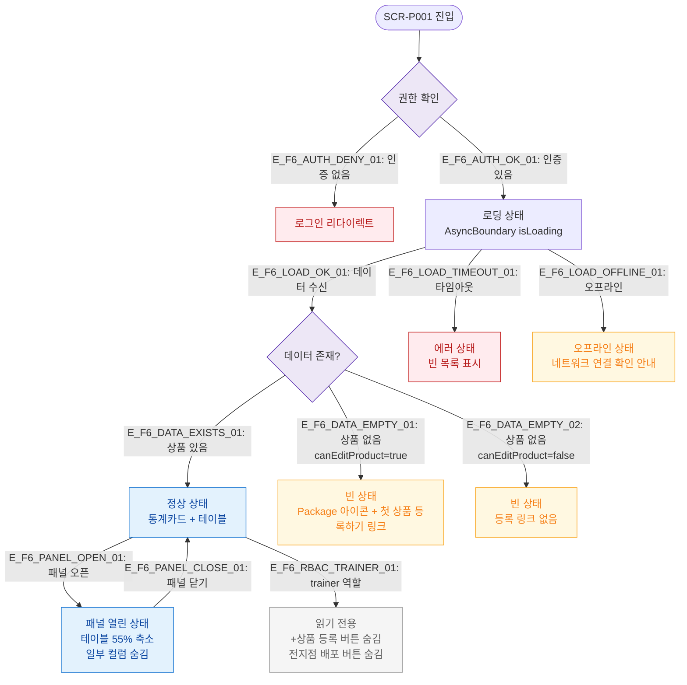

# F6 상태별 화면 플로우 — SCR-P001 상품 관리

## 목적
로딩/빈/에러/권한없음/오프라인 등 UI 상태별 화면 분기를 정의한다.

## 다이어그램

## TC 후보

| TC ID | 타입 | Given | When | Then |
|-------|------|-------|------|------|
| TC-P001-F6-01 | positive | 데이터 로딩 중 | 페이지 진입 | AsyncBoundary 로딩 표시 |
| TC-P001-F6-02 | positive | 상품 없음, 매니저 | 페이지 진입 | Package 아이콘 + 첫 상품 등록하기 링크 |
| TC-P001-F6-03 | positive | 상품 없음, trainer | 페이지 진입 | Package 아이콘, 등록 링크 없음 |
| TC-P001-F6-04 | negative | API 실패 | 페이지 진입 | 빈 목록 표시 |
