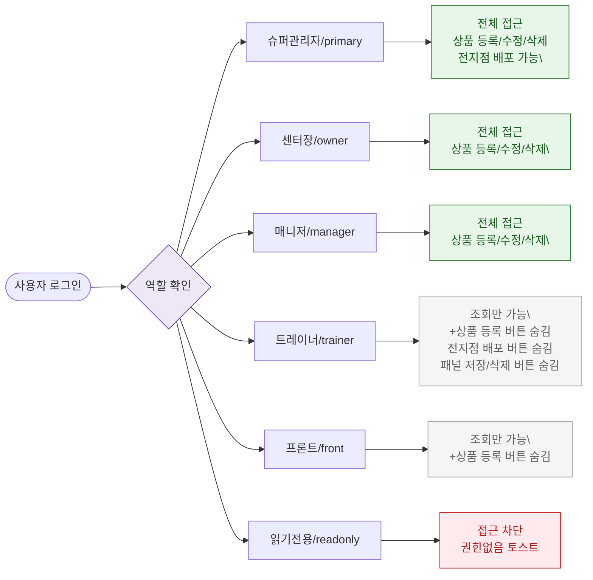

# F7 권한(RBAC) 분기 플로우 — SCR-P001 상품 관리

## 목적
6개 역할별 접근 범위 및 허용/차단 액션을 정의한다.

## 다이어그램

## TC 후보

| TC ID | 타입 | Given | When | Then | |-------|------|-------|------|------| | TC-P001-F7-01 | positive | 슈퍼관리자 로그인 | 상품 관리 진입 | 전지점 배포 버튼 노출, 전체 기능 사용 가능 | | TC-P001-F7-02 | positive | trainer 로그인 | 상품 관리 진입 | +상품 등록 버튼 없음, 조회만 가능 | | TC-P001-F7-03 | positive | front 로그인 | 상품 관리 진입 | 조회만 가능, 수정 불가 | | TC-P001-F7-04 | negative | readonly 역할 | 상품 관리 진입 시도 | 접근 차단, 권한없음 토스트 |
