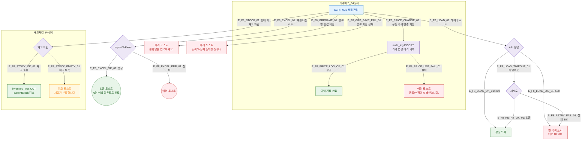

# F8 에러/예외/복구 플로우 — SCR-P001 상품 관리

## 목적
SCR-P001에서 발생 가능한 모든 에러와 복구 경로를 정의한다. 가격이력 변경/할인 중첩/재고 차감 에러는 이 화면의 트리거 포인트를 포함한다.

## 다이어그램

## TC 후보

| TC ID | 타입 | Given | When | Then |
|-------|------|-------|------|------|
| TC-P001-F8-01 | negative | API 500 응답 | 상품 목록 로드 | 빈 목록 표시, 에러 UI 없음 |
| TC-P001-F8-02 | negative | 분류명 공백 | 분류 등록 저장 | 에러 토스트 "분류명을 입력하세요." |
| TC-P001-F8-03 | negative | 분류 저장 API 실패 | 분류 등록 저장 | 에러 토스트 "등록/수정에 실패했습니다." |
| TC-P001-F8-04 | negative | 재고 0개 상품 | 판매 시도 | 경고 토스트 "재고가 부족합니다" |
