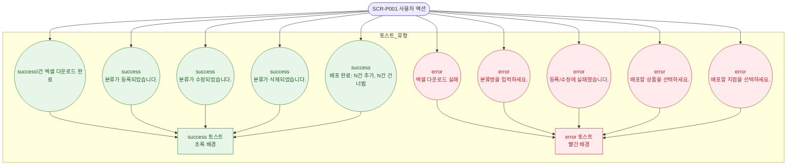

# F9 토스트/피드백 플로우 — SCR-P001 상품 관리

## 목적
SCR-P001에서 발생하는 모든 토스트/피드백 메시지의 발생 조건과 유형을 정의한다.

## 다이어그램

## TC 후보

| TC ID | 타입 | Given | When | Then | |-------|------|-------|------|------| | TC-P001-F9-01 | positive | 엑셀 다운로드 성공 | Excel 버튼 클릭 | success 토스트 "N건 엑셀 다운로드 완료" | | TC-P001-F9-02 | positive | 분류 등록 성공 | 등록 저장 클릭 | success 토스트 "분류가 등록되었습니다." | | TC-P001-F9-03 | positive | 배포 완료 | 전지점 배포 실행 | success 토스트 "배포 완료: N건 추가, N건 건너뜀" |
