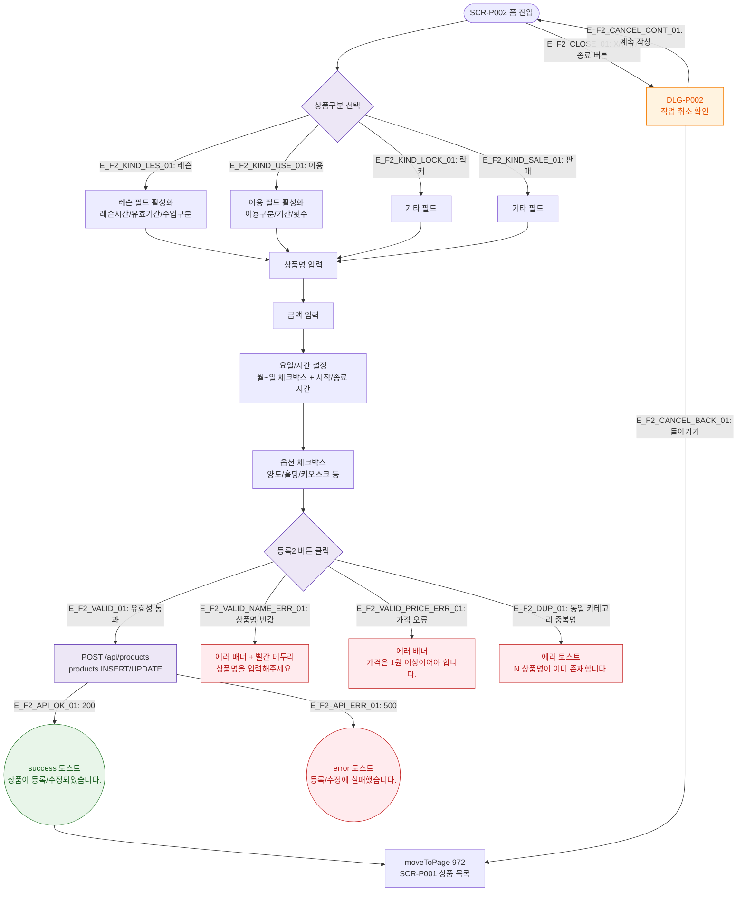

# F2 메인 인터랙션 플로우 — SCR-P002 상품 등록/수정 레거시

## 목적
레거시 폼의 Happy Path: 필드 입력 → 저장 → 상품 목록 이동.

## 다이어그램

## TC 후보

| TC ID | 타입 | Given | When | Then |
|-------|------|-------|------|------|
| TC-P002-F2-01 | positive | 신규 모드 | 상품명+금액 입력 후 등록2 클릭 | success 토스트, 상품 목록 이동 |
| TC-P002-F2-02 | negative | 상품명 공백 | 등록2 클릭 | 에러 배너, 상품명 빨간 테두리 |
| TC-P002-F2-03 | negative | 가격 0원 | 등록2 클릭 | 에러 배너 "가격은 1원 이상" |
| TC-P002-F2-04 | positive | 미저장 상태 | X 버튼 클릭 | DLG-P002 작업 취소 확인 모달 표시 |
