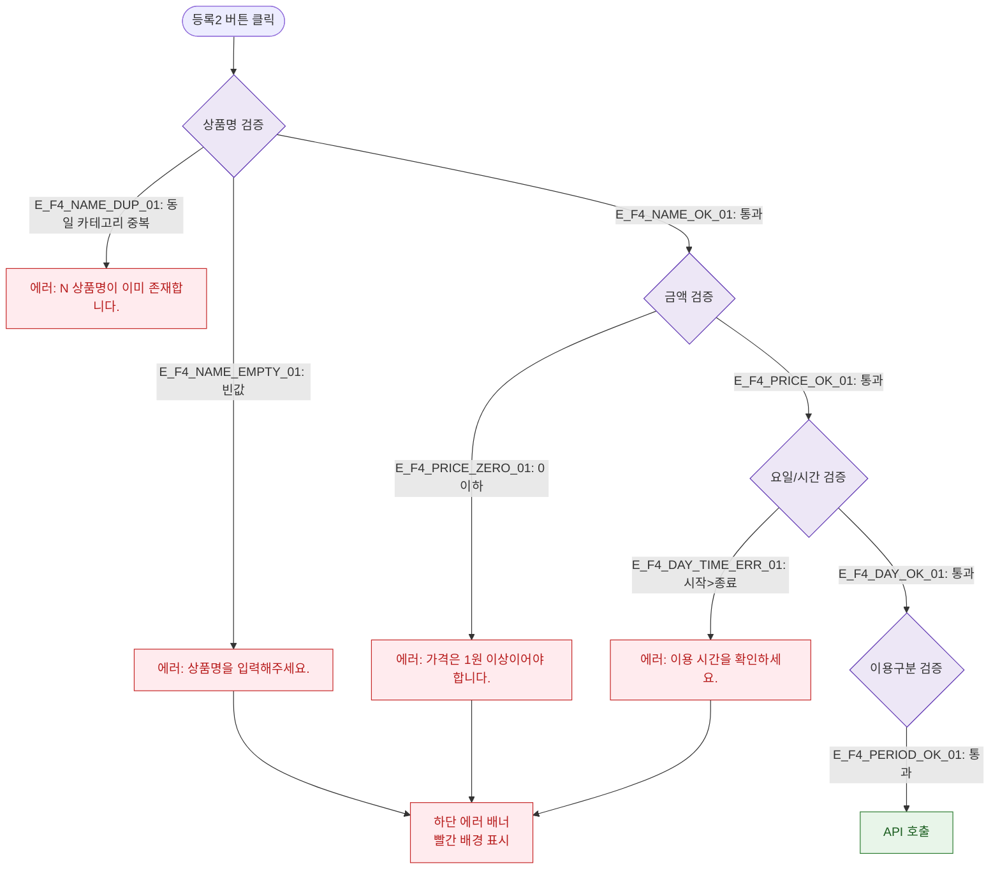

# F4 필드 검증 플로우 — SCR-P002 상품 등록/수정 레거시

## 목적
단일 폼이므로 필터/검색/정렬 대신 필드별 유효성 검증 흐름을 정의한다 (react-hook-form + zod).

## 다이어그램

## TC 후보

| TC ID | 타입 | Given | When | Then |
|-------|------|-------|------|------|
| TC-P002-F4-01 | negative | 상품명 공백 | 등록2 클릭 | 에러 배너 + 빨간 테두리 |
| TC-P002-F4-02 | negative | 금액 0원 | 등록2 클릭 | 에러 배너 "가격은 1원 이상" |
| TC-P002-F4-03 | negative | 중복 상품명 | 등록2 클릭 | 에러 토스트 "이미 존재합니다" |
