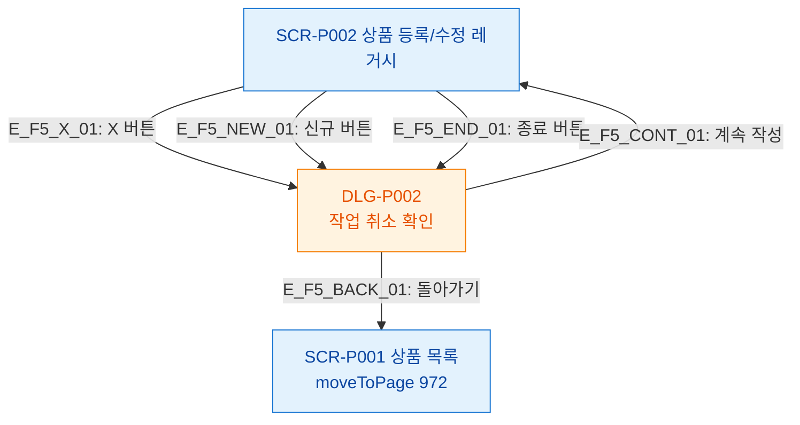

# F5 모달 트리거 트리 — SCR-P002 상품 등록/수정 레거시

## 다이어그램

## TC 후보

| TC ID | 타입 | Given | When | Then |
|-------|------|-------|------|------|
| TC-P002-F5-01 | positive | 폼 작성 중 | X 버튼 클릭 | DLG-P002 모달 표시 |
| TC-P002-F5-02 | positive | DLG-P002 열림 | 돌아가기 클릭 | 상품 목록으로 이동 |
