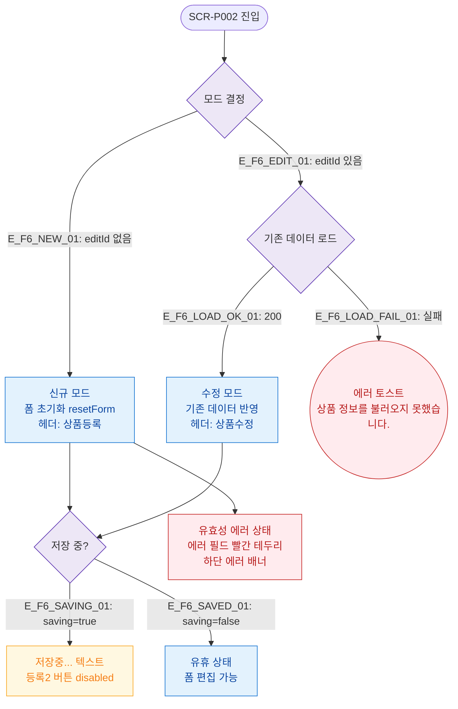

# F6 상태별 화면 플로우 — SCR-P002 상품 등록/수정 레거시

## 다이어그램

## TC 후보

| TC ID | 타입 | Given | When | Then |
|-------|------|-------|------|------|
| TC-P002-F6-01 | positive | 신규 모드 | 폼 진입 | 빈 폼, 헤더 "상품등록" |
| TC-P002-F6-02 | positive | 수정 모드 | editId=5 진입 | 기존 데이터 반영, 헤더 "상품수정" |
| TC-P002-F6-03 | positive | 저장 중 | 등록2 클릭 후 API 대기 | 버튼 disabled, "저장중..." 표시 |
