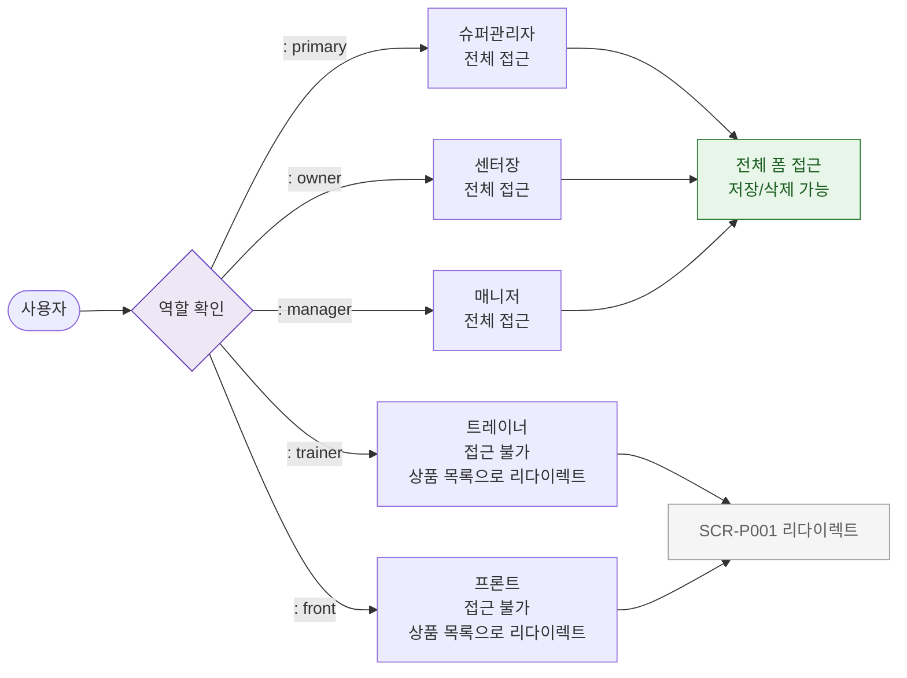

# F7 권한(RBAC) 분기 플로우 — SCR-P002 상품 등록/수정 레거시

## 다이어그램

## TC 후보

| TC ID | 타입 | Given | When | Then | |-------|------|-------|------|------| | TC-P002-F7-01 | positive | manager 로그인 | 진입 | 전체 폼 접근 가능 | | TC-P002-F7-02 | negative | trainer 로그인 | 진입 | 상품 목록으로 리다이렉트 |
