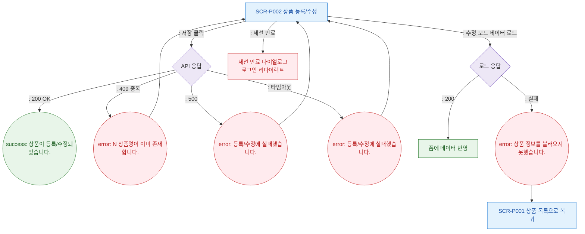

# F8 에러/예외/복구 플로우 — SCR-P002 상품 등록/수정 레거시

## 다이어그램

## TC 후보

| TC ID | 타입 | Given | When | Then | |-------|------|-------|------|------| | TC-P002-F8-01 | negative | 동일 상품명 존재 | 저장 클릭 | error 토스트 "이미 존재합니다" | | TC-P002-F8-02 | negative | API 500 응답 | 저장 클릭 | error 토스트 "등록/수정에 실패" | | TC-P002-F8-03 | negative | 수정 모드 로드 실패 | 페이지 진입 | error 토스트, 폼 접근 불가 |
