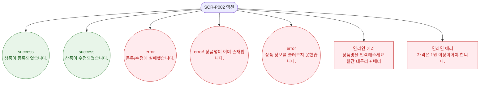

# F9 토스트/피드백 플로우 — SCR-P002 상품 등록/수정 레거시

## 다이어그램

## TC 후보

| TC ID | 타입 | Given | When | Then | |-------|------|-------|------|------| | TC-P002-F9-01 | positive | 신규 등록 성공 | 등록2 클릭 | success 토스트 "상품이 등록되었습니다." | | TC-P002-F9-02 | positive | 수정 성공 | 등록2 클릭 | success 토스트 "상품이 수정되었습니다." |
