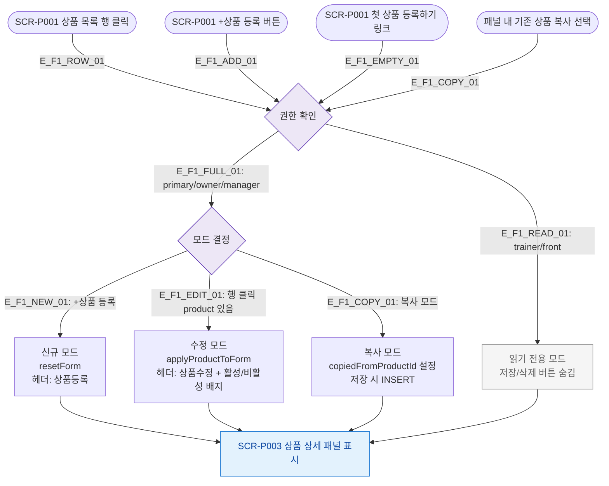

# F1 진입 플로우 — SCR-P003 상품 상세 패널

## 목적
ProductDetailPanel이 열리는 모든 진입 경로를 정의한다.

## 다이어그램

## TC 후보

| TC ID | 타입 | Given | When | Then |
|-------|------|-------|------|------|
| TC-P003-F1-01 | positive | 매니저, 상품 목록 | 상품 행 클릭 | 패널 수정 모드로 오픈, 기존 데이터 반영 |
| TC-P003-F1-02 | positive | 매니저 | +상품 등록 클릭 | 패널 신규 모드, 빈 폼 |
| TC-P003-F1-03 | positive | trainer | 상품 행 클릭 | 패널 읽기 전용, 저장/삭제 버튼 없음 |
