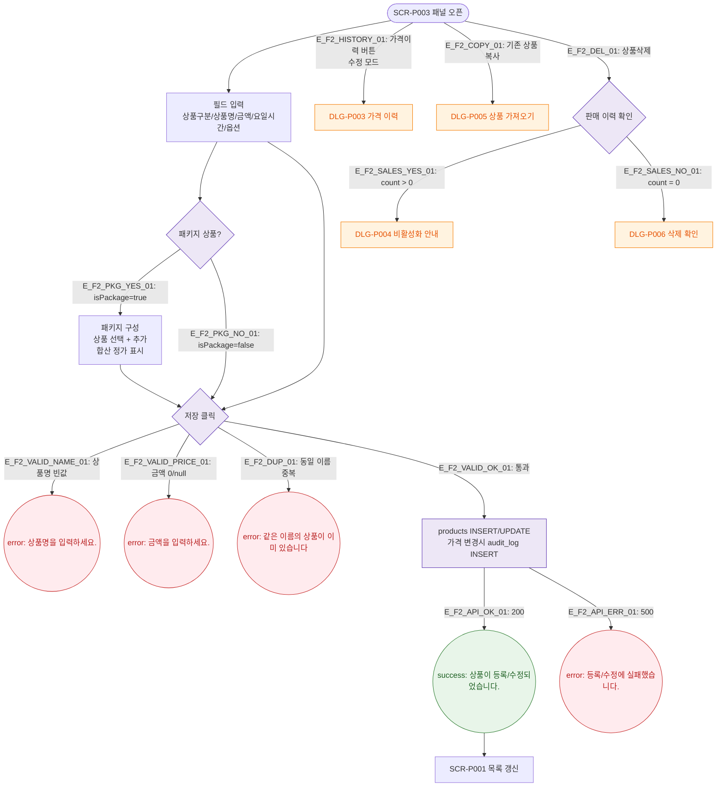

# F2 메인 인터랙션 플로우 — SCR-P003 상품 상세 패널

## 목적
상품 상세 패널의 Happy Path: 입력 → 패키지 구성 → 저장. 가격이력/삭제/복사 분기 포함.

## 다이어그램

## TC 후보

| TC ID | 타입 | Given | When | Then |
|-------|------|-------|------|------|
| TC-P003-F2-01 | positive | 신규 모드 | 상품명+금액 입력 후 저장 | success 토스트, 목록 갱신 |
| TC-P003-F2-02 | negative | 상품명 공백 | 저장 클릭 | error 토스트 "상품명을 입력하세요." |
| TC-P003-F2-03 | negative | 금액 0 | 저장 클릭 | error 토스트 "금액을 입력하세요." |
| TC-P003-F2-04 | positive | 판매이력 있는 상품 | 상품삭제 클릭 | DLG-P004 비활성화 안내 표시 |
| TC-P003-F2-05 | positive | 패키지 활성화 | isPackage 체크 | 패키지 구성 섹션 펼쳐짐 |
