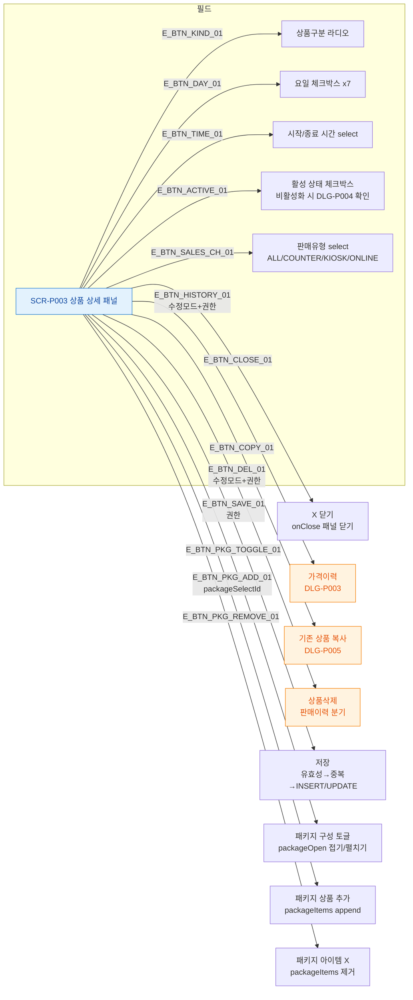

# F3 버튼/액션 매핑 — SCR-P003 상품 상세 패널

## 다이어그램

## TC 후보

| TC ID | 타입 | Given | When | Then |
|-------|------|-------|------|------|
| TC-P003-F3-01 | positive | 수정 모드 | 가격이력 버튼 클릭 | DLG-P003 모달 오픈 |
| TC-P003-F3-02 | positive | 패키지 섹션 | 상품 선택 후 추가 클릭 | packageItems 목록에 추가 |
| TC-P003-F3-03 | positive | trainer 역할 | 패널 열림 | 저장/삭제/가격이력 버튼 숨김 |
