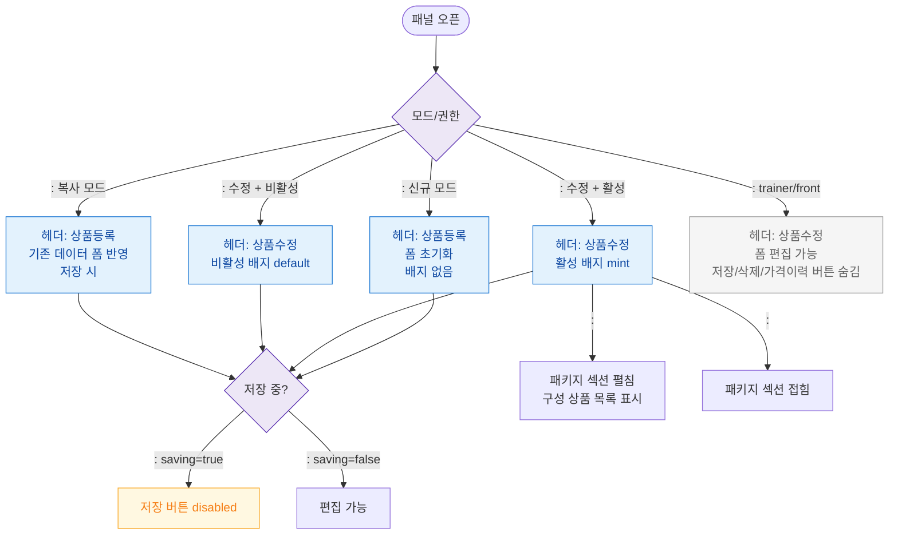

# F6 상태별 화면 플로우 — SCR-P003 상품 상세 패널

## 다이어그램

## TC 후보

| TC ID | 타입 | Given | When | Then | |-------|------|-------|------|------| | TC-P003-F6-01 | positive | 신규 모드 | 패널 오픈 | 헤더 "상품등록", 빈 폼 | | TC-P003-F6-02 | positive | 활성 상품 수정 | 패널 오픈 | 헤더 "상품수정" + 활성 배지 | | TC-P003-F6-03 | positive | 저장 클릭 | API 대기 중 | 저장 버튼 disabled |
