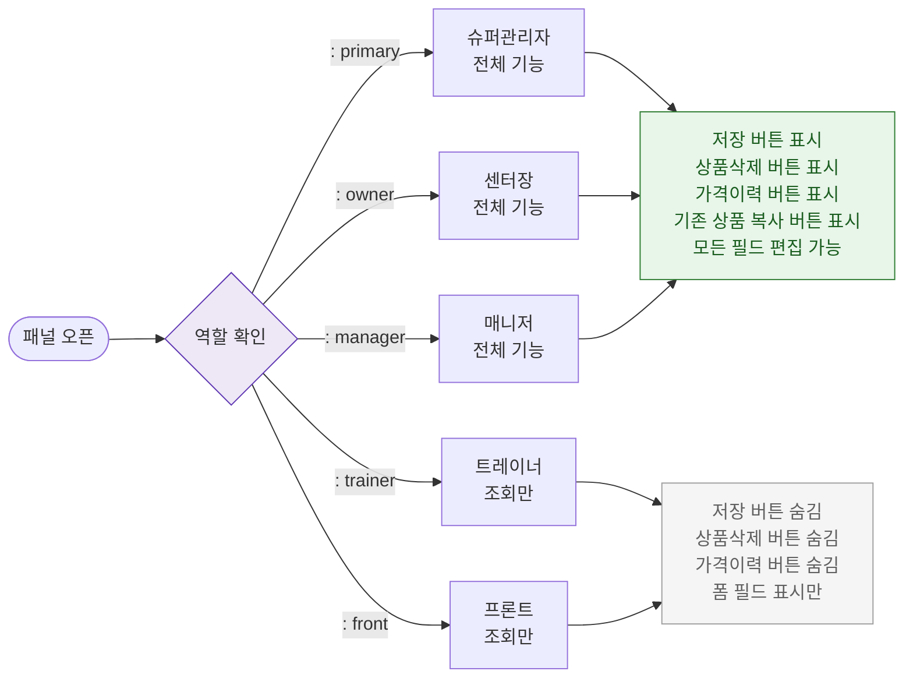

# F7 권한(RBAC) 분기 플로우 — SCR-P003 상품 상세 패널

## 다이어그램

## TC 후보

| TC ID | 타입 | Given | When | Then | |-------|------|-------|------|------| | TC-P003-F7-01 | positive | manager | 패널 오픈 | 저장/삭제/가격이력 버튼 모두 표시 | | TC-P003-F7-02 | positive | trainer | 패널 오픈 | 저장/삭제/가격이력 버튼 숨김 |
