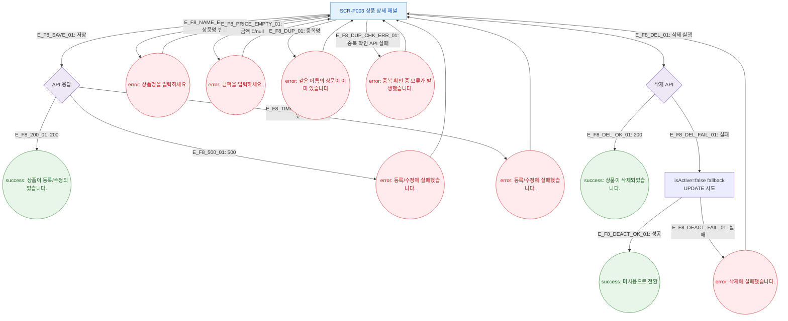

# F8 에러/예외/복구 플로우 — SCR-P003 상품 상세 패널

## 다이어그램

## TC 후보

| TC ID | 타입 | Given | When | Then |
|-------|------|-------|------|------|
| TC-P003-F8-01 | negative | API 500 | 저장 클릭 | error 토스트 "등록/수정에 실패했습니다." |
| TC-P003-F8-02 | negative | 중복 상품명 | 저장 클릭 | error 토스트 "같은 이름의 상품이 이미 있습니다" |
| TC-P003-F8-03 | negative | 삭제 API 실패 | 삭제 확인 | isActive=false fallback 시도 |
| TC-P003-F8-04 | negative | 금액 null | 저장 클릭 | error 토스트 "금액을 입력하세요." |
