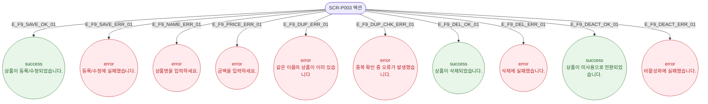

# F9 토스트/피드백 플로우 — SCR-P003 상품 상세 패널

## 다이어그램

## TC 후보

| TC ID | 타입 | Given | When | Then |
|-------|------|-------|------|------|
| TC-P003-F9-01 | positive | 저장 성공 | 저장 클릭 | success 토스트 "상품이 등록/수정되었습니다." |
| TC-P003-F9-02 | positive | 삭제 성공 | 삭제 확인 | success 토스트 "상품이 삭제되었습니다." |
| TC-P003-F9-03 | positive | 미사용 전환 | 미사용 전환 클릭 | success 토스트 "미사용으로 전환되었습니다." |
