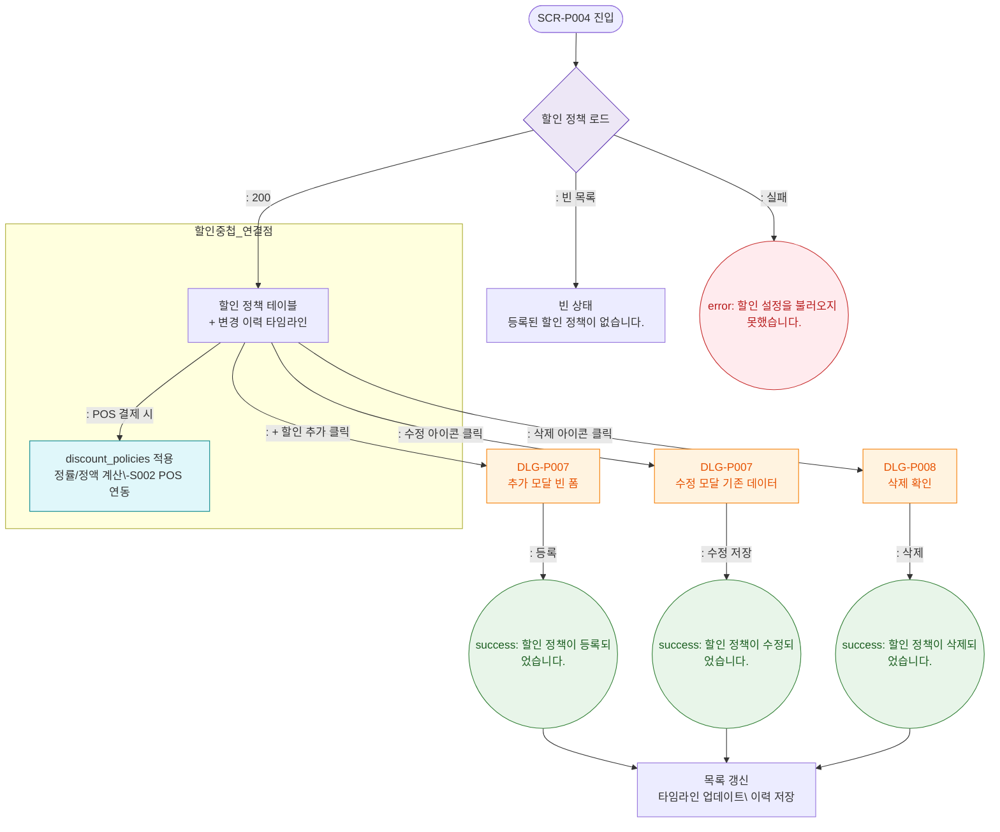

# F2 메인 인터랙션 플로우 — SCR-P004 할인 설정

## 목적
할인 정책 CRUD Happy Path. 할인 정책은 POS 결제 시 적용되어 D3 매출관리와 연결된다.

## 다이어그램

## TC 후보

| TC ID | 타입 | Given | When | Then | |-------|------|-------|------|------| | TC-P004-F2-01 | positive | 할인 정책 없음 | 페이지 진입 | 빈 상태 메시지 표시 | | TC-P004-F2-02 | positive | + 할인 추가 클릭 | 버튼 클릭 | DLG-P007 빈 폼 오픈 | | TC-P004-F2-03 | positive | 수정 아이콘 클릭 | 클릭 | DLG-P007 기존 데이터 로드 |
