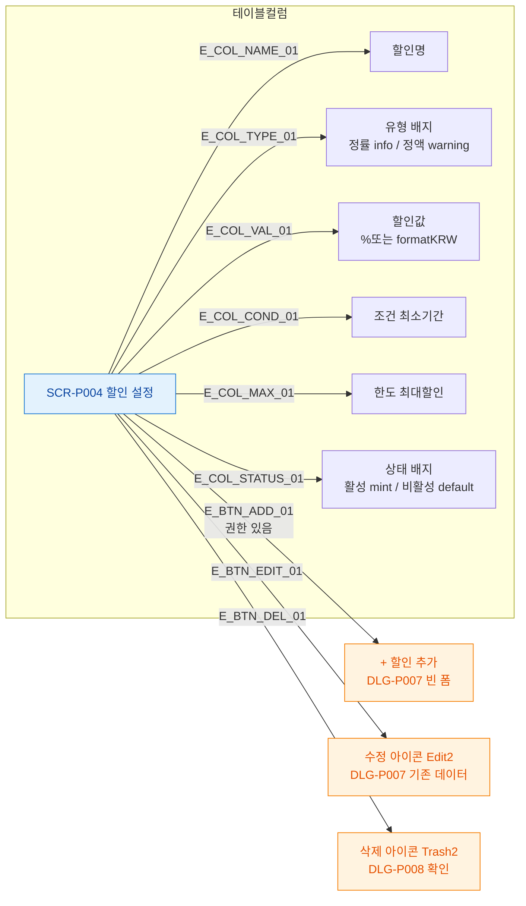

# F3 버튼/액션 매핑 — SCR-P004 할인 설정

## 다이어그램

```mermaid
flowchart LR
    SCR_P004[SCR-P004 할인 설정]

    SCR_P004 -->|E_BTN_ADD_01\n권한 있음| BTN_ADD[+ 할인 추가\nDLG-P007 빈 폼]
    SCR_P004 -->|E_BTN_EDIT_01| BTN_EDIT[수정 아이콘 Edit2\nDLG-P007 기존 데이터]
    SCR_P004 -->|E_BTN_DEL_01| BTN_DEL[삭제 아이콘 Trash2\nDLG-P008 확인]

    subgraph 테이블컬럼
        SCR_P004 -->|E_COL_NAME_01| COL_NAME[할인명]
        SCR_P004 -->|E_COL_TYPE_01| COL_TYPE[유형 배지\n정률 info / 정액 warning]
        SCR_P004 -->|E_COL_VAL_01| COL_VAL[할인값\n%또는 formatKRW]
        SCR_P004 -->|E_COL_COND_01| COL_COND[조건 최소기간]
        SCR_P004 -->|E_COL_MAX_01| COL_MAX[한도 최대할인]
        SCR_P004 -->|E_COL_STATUS_01| COL_STATUS[상태 배지\n활성 mint / 비활성 default]
    end

    classDef screen fill:#E3F2FD,stroke:#1976D2,color:#0D47A1
    classDef modal fill:#FFF3E0,stroke:#F57C00,color:#E65100
    class SCR_P004 screen
    class BTN_ADD,BTN_EDIT,BTN_DEL modal
```

## TC 후보

| TC ID | 타입 | Given | When | Then |
|-------|------|-------|------|------|
| TC-P004-F3-01 | positive | trainer 역할 | 할인 설정 진입 | + 할인 추가 버튼 숨김 |
