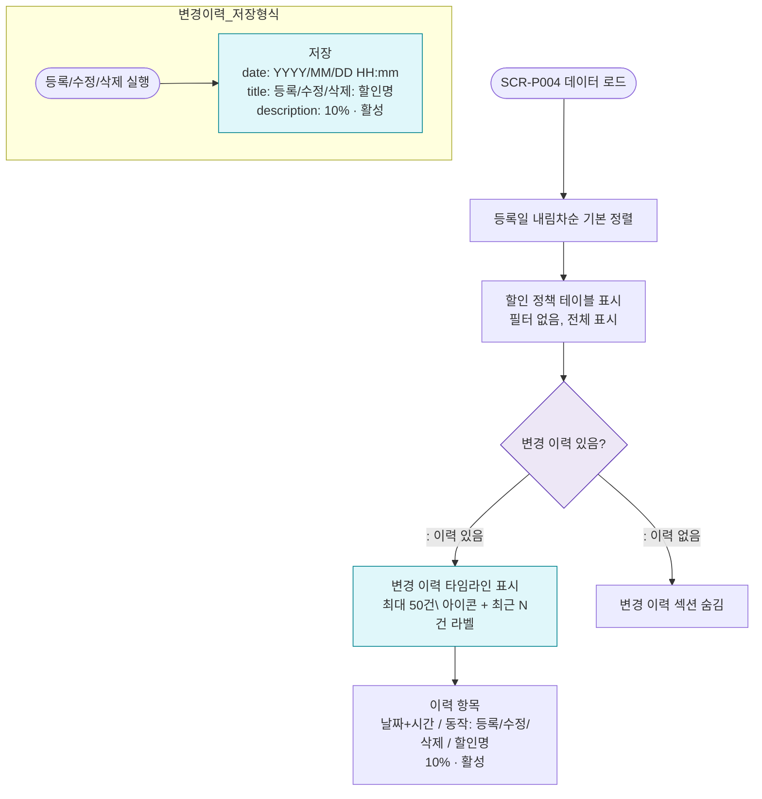

# F4 필터/정렬/이력 플로우 — SCR-P004 할인 설정

## 목적
할인 설정은 필터 없음, 등록일 내림차순 기본 정렬. 기반 변경 이력 타임라인 표시.

## 다이어그램

## TC 후보

| TC ID | 타입 | Given | When | Then | |-------|------|-------|------|------| | TC-P004-F4-01 | positive | 할인 정책 3개 | 페이지 진입 | 등록일 내림차순 정렬 표시 | | TC-P004-F4-02 | positive | 등록 완료 후 | 목록 재진입 | 변경 이력 타임라인에 등록 이력 표시 |
