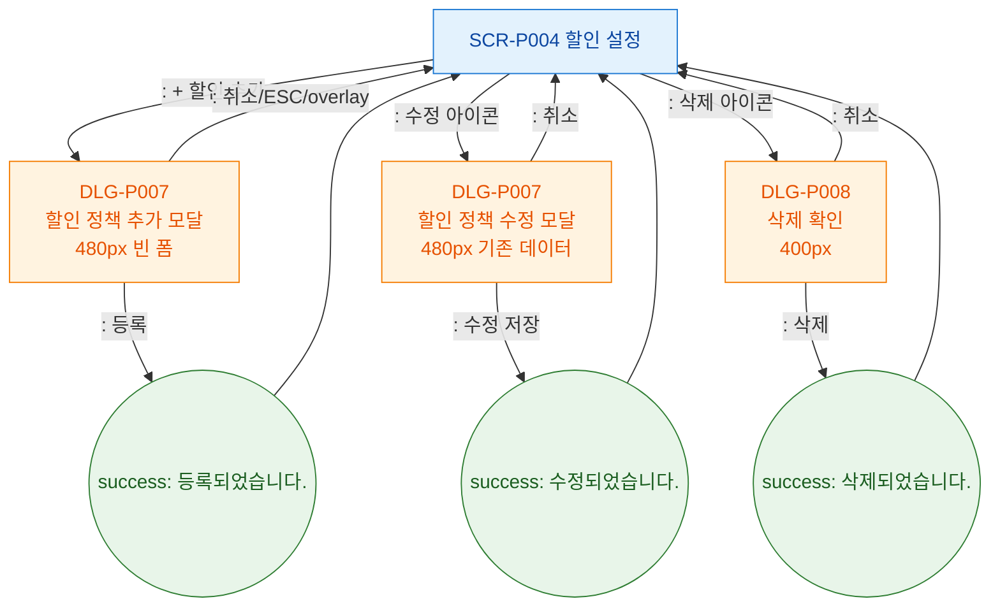

# F5 모달 트리거 트리 — SCR-P004 할인 설정

## 다이어그램

## TC 후보

| TC ID | 타입 | Given | When | Then | |-------|------|-------|------|------| | TC-P004-F5-01 | positive | + 할인 추가 | 클릭 | DLG-P007 빈 폼 오픈 | | TC-P004-F5-02 | positive | 수정 아이콘 | 클릭 | DLG-P007 기존 데이터 로드 | | TC-P004-F5-03 | positive | 삭제 아이콘 | 클릭 | DLG-P008 확인 다이얼로그 |
