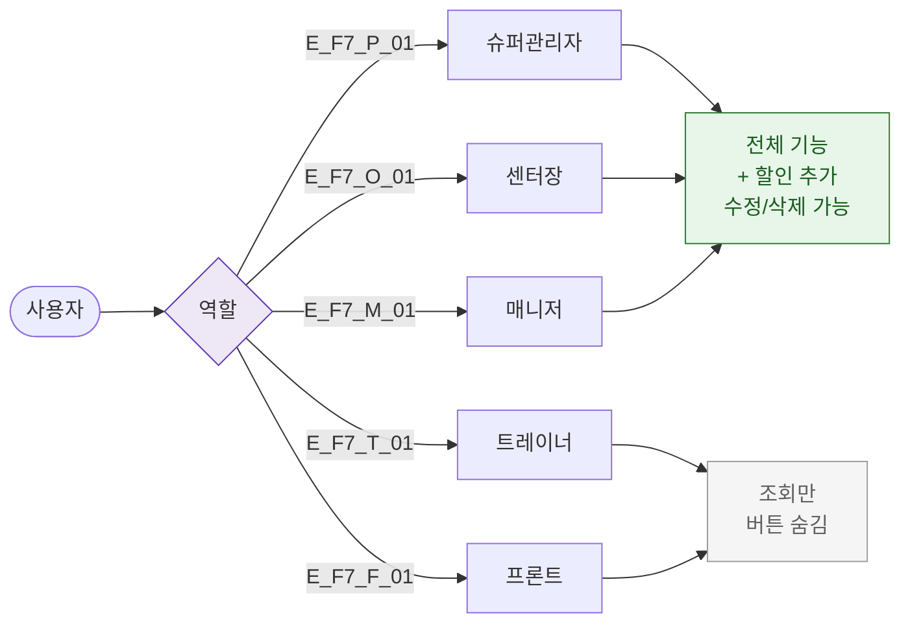

# F7 권한(RBAC) 분기 플로우 — SCR-P004 할인 설정

## 다이어그램

## TC 후보

| TC ID | 타입 | Given | When | Then |
|-------|------|-------|------|------|
| TC-P004-F7-01 | positive | manager | 할인 설정 진입 | 추가/수정/삭제 버튼 표시 |
| TC-P004-F7-02 | positive | trainer | 할인 설정 진입 | 조회만, 버튼 없음 |
