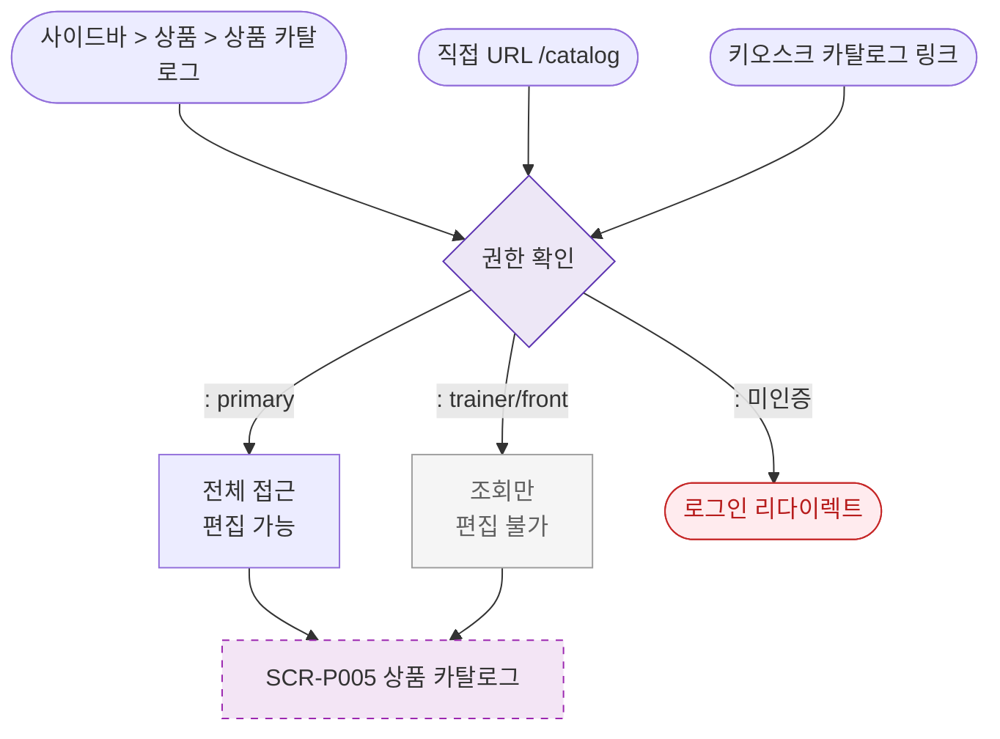

# F1 진입 플로우 — SCR-P005 상품 카탈로그 🆕

## 다이어그램

## TC 후보

| TC ID | 타입 | Given | When | Then | |-------|------|-------|------|------| | TC-P005-F1-01 | positive | 매니저 | 카탈로그 진입 | 전체 기능, 편집 버튼 표시 | | TC-P005-F1-02 | positive | trainer | 카탈로그 진입 | 조회만, 편집 버튼 숨김 |
