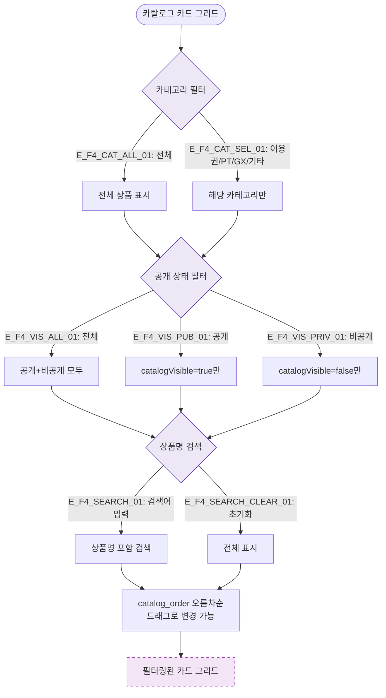

# F4 필터/검색/정렬 플로우 — SCR-P005 상품 카탈로그 🆕

## 다이어그램

## TC 후보

| TC ID | 타입 | Given | When | Then |
|-------|------|-------|------|------|
| TC-P005-F4-01 | positive | 전체 카탈로그 | PT 카테고리 선택 | PT 상품만 카드 표시 |
| TC-P005-F4-02 | positive | 공개/비공개 혼재 | 공개 필터 | catalogVisible=true 상품만 표시 |
| TC-P005-F4-03 | positive | 상품 목록 | 검색어 입력 | 상품명 포함 결과만 표시 |
