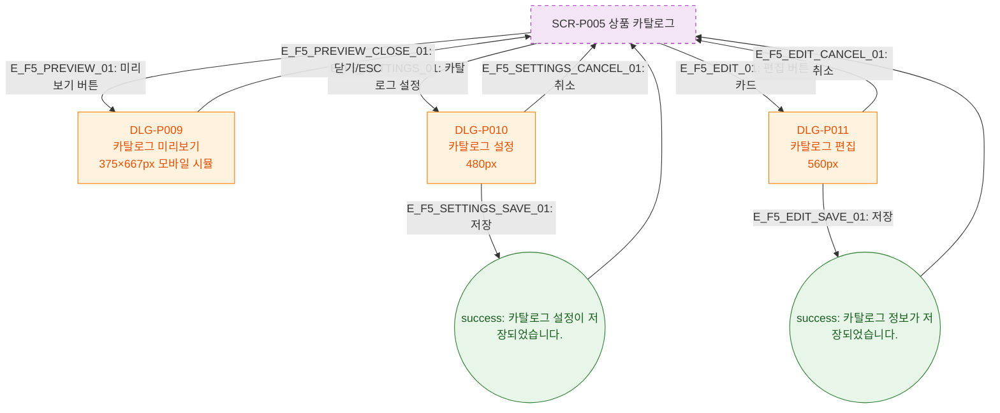

# F5 모달 트리거 트리 — SCR-P005 상품 카탈로그 🆕

## 다이어그램

## TC 후보

| TC ID | 타입 | Given | When | Then |
|-------|------|-------|------|------|
| TC-P005-F5-01 | positive | 미리보기 클릭 | 버튼 클릭 | DLG-P009 375px 모바일 시뮬 오픈 |
| TC-P005-F5-02 | positive | 카탈로그 설정 클릭 | 버튼 클릭 | DLG-P010 설정 모달 오픈 |
| TC-P005-F5-03 | positive | 카드 편집 클릭 | 버튼 클릭 | DLG-P011 해당 상품 편집 오픈 |
