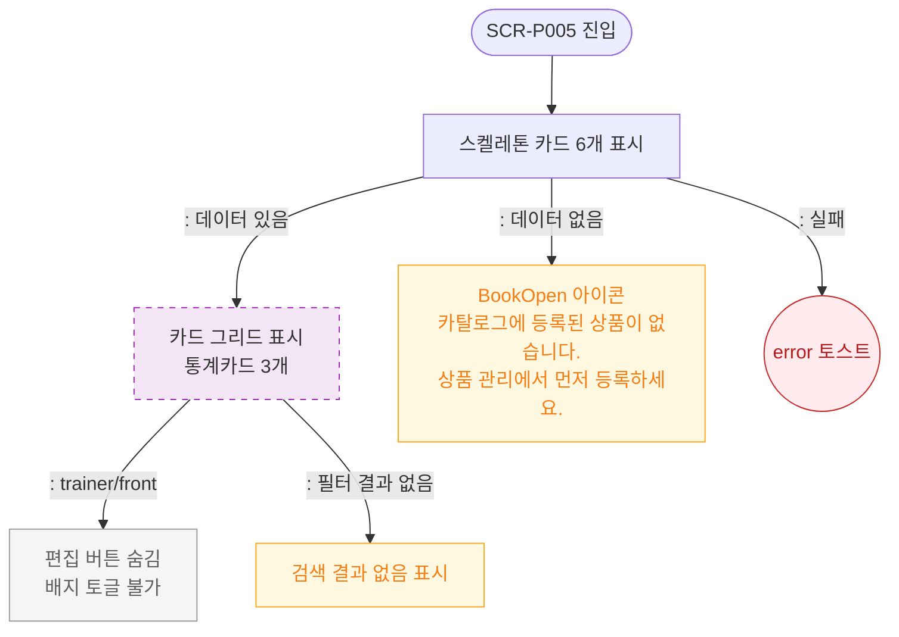

# F6 상태별 화면 플로우 — SCR-P005 상품 카탈로그 🆕

## 다이어그램

## TC 후보

| TC ID | 타입 | Given | When | Then | |-------|------|-------|------|------| | TC-P005-F6-01 | positive | 로딩 중 | 페이지 진입 | 스켈레톤 카드 6개 표시 | | TC-P005-F6-02 | positive | 상품 없음 | 페이지 진입 | BookOpen 빈 상태 표시 | | TC-P005-F6-03 | positive | trainer 역할 | 카탈로그 진입 | 편집 버튼 없음 |
