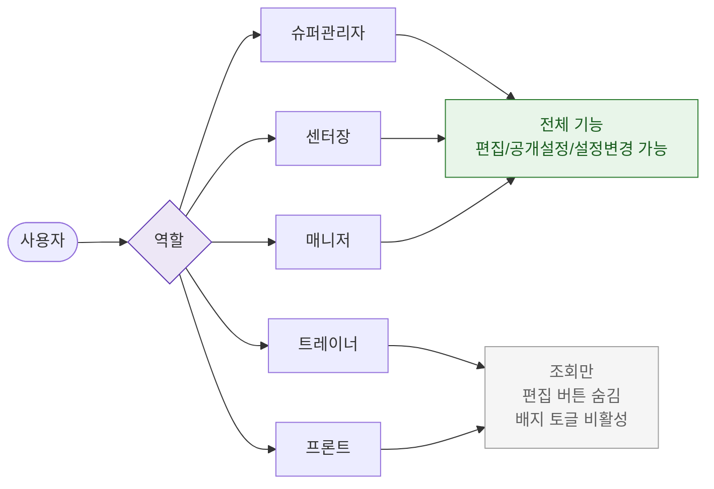

# F7 권한(RBAC) 분기 플로우 — SCR-P005 상품 카탈로그 🆕

## 다이어그램

## TC 후보

| TC ID | 타입 | Given | When | Then | |-------|------|-------|------|------| | TC-P005-F7-01 | positive | manager | 카탈로그 진입 | 편집/공개 설정 가능 | | TC-P005-F7-02 | positive | front | 카탈로그 진입 | 조회만, 편집 불가 |
