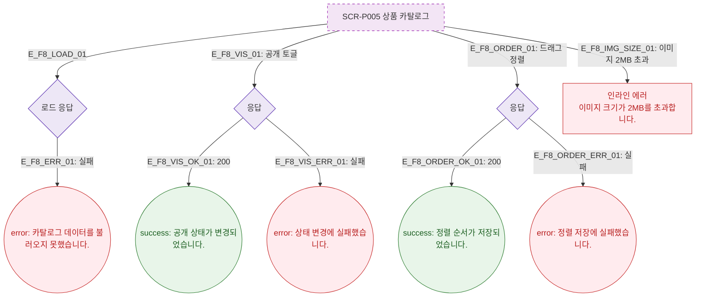

# F8 에러/예외/복구 플로우 — SCR-P005 상품 카탈로그 🆕

## 다이어그램

## TC 후보

| TC ID | 타입 | Given | When | Then |
|-------|------|-------|------|------|
| TC-P005-F8-01 | negative | API 실패 | 페이지 진입 | error 토스트 "카탈로그 데이터를 불러오지 못했습니다." |
| TC-P005-F8-02 | negative | 이미지 3MB | 이미지 업로드 | 인라인 에러 "이미지 크기가 2MB를 초과합니다." |
