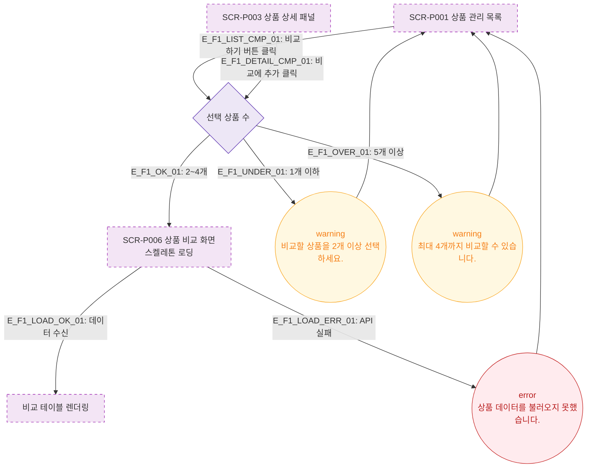

# F1 진입 플로우 — SCR-P006 상품 비교 🆕

## 목적
상품 비교 화면(SCR-P006)으로 진입하는 모든 경로를 정의하고, 선행 조건 및 초기 렌더링 상태를 명시한다.

## 전제조건
- SCR-P001 상품 관리 목록에서 비교 버튼 클릭 또는 SCR-P003 상품 상세 패널에서 비교 추가로 접근
- 최대 4개 상품 선택 가능, 최소 2개 이상 선택 시 비교 활성화
- RBAC: 모든 역할 조회 가능

## 다이어그램

## 엣지 설명

| 엣지 ID | 출발 | 도착 | 설명 |
|---------|------|------|------|
| E_F1_LIST_CMP_01 | SCR-P001 | CheckCount | 목록에서 체크박스 선택 후 비교 버튼 클릭 |
| E_F1_DETAIL_CMP_01 | SCR-P003 | CheckCount | 상세 패널 비교 추가 버튼 클릭 |
| E_F1_OK_01 | CheckCount | SCR-P006 | 2~4개 선택 → 비교 화면 진입 |
| E_F1_UNDER_01 | CheckCount | WarnToast | 1개 이하 선택 시 경고 |
| E_F1_OVER_01 | CheckCount | WarnToast2 | 5개 이상 선택 시 경고 |
| E_F1_LOAD_OK_01 | SCR-P006 | CompareReady | 데이터 로드 성공 → 테이블 표시 |
| E_F1_LOAD_ERR_01 | SCR-P006 | ErrToast | API 실패 → 에러 토스트 |

## TC 후보

| TC ID | 타입 | Given | When | Then |
|-------|------|-------|------|------|
| TC-P006-F1-01 | positive | 상품 2개 선택 | 비교하기 클릭 | SCR-P006 진입, 비교 테이블 표시 |
| TC-P006-F1-02 | negative | 상품 1개 선택 | 비교하기 클릭 | warning 토스트 "2개 이상 선택하세요." |
| TC-P006-F1-03 | negative | 상품 5개 선택 시도 | 5번째 체크박스 클릭 | warning 토스트 "최대 4개" |
