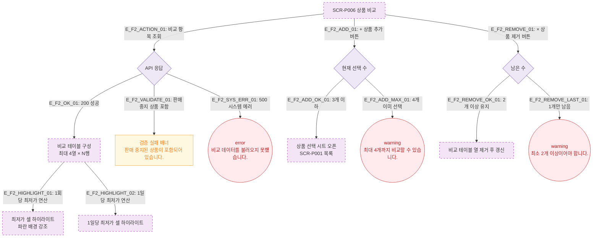

# F2 메인 인터랙션 플로우 — SCR-P006 상품 비교 🆕

## 목적
상품 비교 화면의 핵심 인터랙션(상품 추가/제거, 비교 테이블 갱신, 최저가 하이라이트)을 정의한다.

## 전제조건
- 2~4개 상품이 선택된 상태로 진입
- 비교 항목: 가격(1회당/1일당), 할인 적용가, 재고, 유효기간, 이용권 연동 여부

## 다이어그램

## 엣지 설명

| 엣지 ID | 출발 | 도착 | 설명 |
|---------|------|------|------|
| E_F2_ACTION_01 | SCR-P006 | CompareAPI | 비교 화면 진입 시 상품 데이터 일괄 조회 |
| E_F2_OK_01 | CompareAPI | BuildTable | 정상 응답 → 비교 테이블 구성 |
| E_F2_VALIDATE_01 | CompareAPI | ValidationFail | 판매 중지 상품 포함 시 검증 실패 배너 |
| E_F2_SYS_ERR_01 | CompareAPI | SysErr | 500 오류 → 에러 토스트 |
| E_F2_HIGHLIGHT_01 | BuildTable | HighlightPrice | 1회당 최저가 셀 파랑 강조 |
| E_F2_HIGHLIGHT_02 | BuildTable | HighlightDay | 1일당 최저가 셀 강조 |
| E_F2_ADD_01 | SCR-P006 | AddProduct | 상품 추가 버튼 클릭 |
| E_F2_ADD_OK_01 | AddProduct | SelectSheet | 4개 미만 → 선택 시트 오픈 |
| E_F2_ADD_MAX_01 | AddProduct | WarnMax | 4개 이미 선택 → 경고 |
| E_F2_REMOVE_01 | SCR-P006 | RemoveProduct | × 버튼 클릭 |
| E_F2_REMOVE_OK_01 | RemoveProduct | UpdateTable | 2개 이상 유지 → 열 제거 후 갱신 |
| E_F2_REMOVE_LAST_01 | RemoveProduct | WarnMin | 1개만 남음 → 경고 |

## TC 후보

| TC ID | 타입 | Given | When | Then |
|-------|------|-------|------|------|
| TC-P006-F2-01 | positive | 상품 3개 선택 | 비교 화면 진입 | 비교 테이블 3열, 최저가 하이라이트 표시 |
| TC-P006-F2-02 | negative | 판매중지 상품 포함 | API 응답 | 검증 실패 배너 표시 |
| TC-P006-F2-03 | positive | 4개 선택 중 + 추가 | + 버튼 클릭 | warning "최대 4개" |
| TC-P006-F2-04 | negative | 2개 선택 중 × 제거 | × 버튼 클릭 | warning "최소 2개" |
