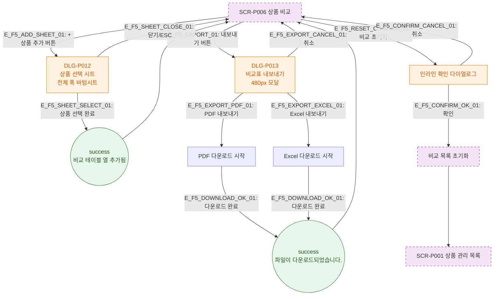

# F5 모달 트리거 트리 — SCR-P006 상품 비교 🆕

## 목적
상품 비교 화면에서 열리는 모달/시트의 트리거, 생명주기, 닫기 동작을 정의한다.

## 다이어그램

## TC 후보

| TC ID | 타입 | Given | When | Then |
|-------|------|-------|------|------|
| TC-P006-F5-01 | positive | 3개 비교 중 | + 상품 추가 클릭 | DLG-P012 바텀시트 오픈 |
| TC-P006-F5-02 | positive | 내보내기 클릭 | PDF 선택 | PDF 다운로드 + success 토스트 |
| TC-P006-F5-03 | positive | 비교 초기화 확인 | 확인 클릭 | 비교 목록 초기화, SCR-P001 이동 |
