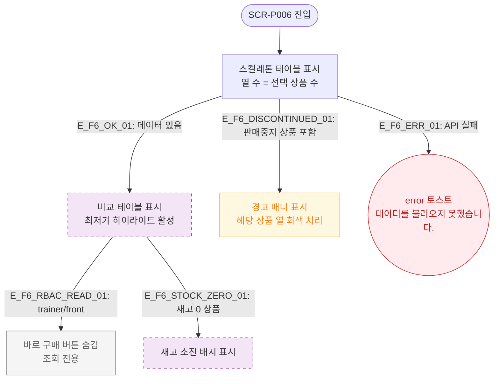

# F6 상태별 화면 플로우 — SCR-P006 상품 비교 🆕

## 다이어그램

## TC 후보

| TC ID | 타입 | Given | When | Then |
|-------|------|-------|------|------|
| TC-P006-F6-01 | positive | 로딩 중 | 페이지 진입 | 스켈레톤 테이블 표시 |
| TC-P006-F6-02 | negative | 판매중지 상품 포함 | 비교 화면 진입 | 경고 배너 + 해당 열 회색 처리 |
| TC-P006-F6-03 | positive | trainer 역할 | 비교 화면 진입 | 바로 구매 버튼 숨김 |
