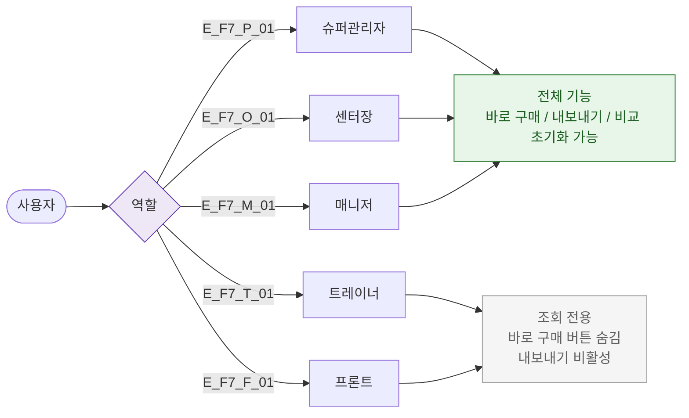

# F7 권한(RBAC) 분기 플로우 — SCR-P006 상품 비교 🆕

## 다이어그램

## TC 후보

| TC ID | 타입 | Given | When | Then |
|-------|------|-------|------|------|
| TC-P006-F7-01 | positive | manager | 비교 화면 진입 | 바로 구매/내보내기 모두 가능 |
| TC-P006-F7-02 | positive | front | 비교 화면 진입 | 바로 구매 버튼 숨김, 조회 전용 |
