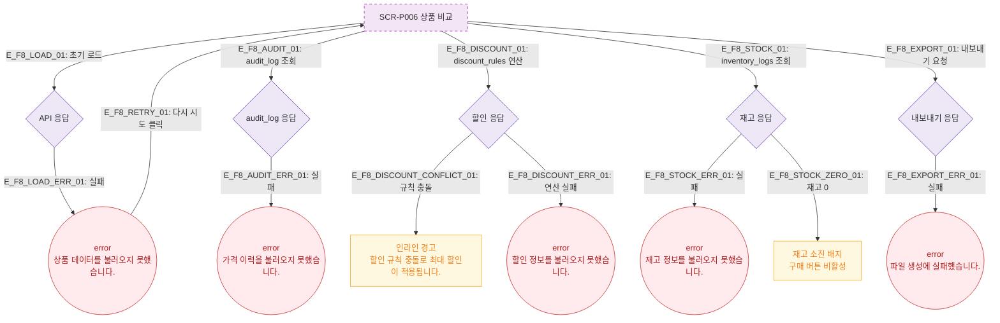

# F8 에러/예외/복구 플로우 — SCR-P006 상품 비교 🆕

## 목적
비교 화면에서 발생하는 에러·예외 상황과 복구 경로를 상세화한다.  
계획서 요구사항에 따라 **가격이력(audit_log)**, **할인중첩(discount stacking)**, **재고차감(inventory_logs)** 관련 에러도 포함한다.

## 다이어그램

## TC 후보

| TC ID | 타입 | Given | When | Then |
|-------|------|-------|------|------|
| TC-P006-F8-01 | negative | API 실패 | 비교 화면 진입 | error 토스트 "상품 데이터를 불러오지 못했습니다." + 다시 시도 |
| TC-P006-F8-02 | negative | 할인 규칙 충돌 | 비교 테이블 렌더링 | 인라인 경고 "규칙 충돌로 최대 할인 적용" |
| TC-P006-F8-03 | negative | 재고 0 상품 포함 | 비교 테이블 표시 | 재고 소진 배지, 구매 버튼 비활성 |
