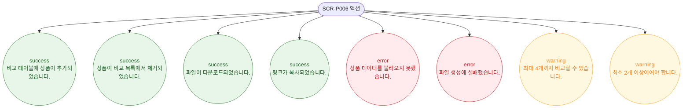

# F9 토스트/피드백 플로우 — SCR-P006 상품 비교 🆕

## 다이어그램

## TC 후보

| TC ID | 타입 | Given | When | Then | |-------|------|-------|------|------| | TC-P006-F9-01 | positive | + 추가 완료 | 상품 선택 시트 확인 | success 토스트 "비교 테이블에 상품이 추가되었습니다." | | TC-P006-F9-02 | positive | 내보내기 완료 | PDF/Excel 다운로드 | success 토스트 "파일이 다운로드되었습니다." | | TC-P006-F9-03 | negative | API 실패 | 페이지 진입 | error 토스트 "상품 데이터를 불러오지 못했습니다." |
