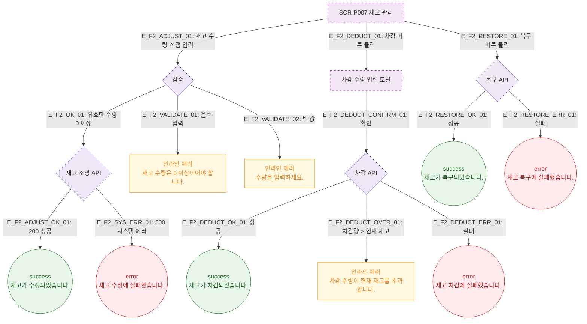

# F2 메인 인터랙션 플로우 — SCR-P007 재고 관리 🆕

## 목적
재고 관리 화면의 핵심 인터랙션(재고 수동 조정, 차감 처리, 복구)을 정의하며 F2 의무 3갈래 분기(성공/검증실패/시스템에러)를 포함한다.

## 다이어그램

## TC 후보

| TC ID | 타입 | Given | When | Then |
|-------|------|-------|------|------|
| TC-P007-F2-01 | positive | 유효한 수량 입력 | 재고 조정 저장 | success 토스트 "재고가 수정되었습니다." |
| TC-P007-F2-02 | negative | 음수 수량 입력 | 저장 시도 | 인라인 에러 "0 이상이어야 합니다." |
| TC-P007-F2-03 | negative | 차감량 > 현재 재고 | 차감 확인 | 인라인 에러 "현재 재고를 초과합니다." |
| TC-P007-F2-04 | negative | API 500 | 재고 조정 저장 | error 토스트 "재고 수정에 실패했습니다." |
