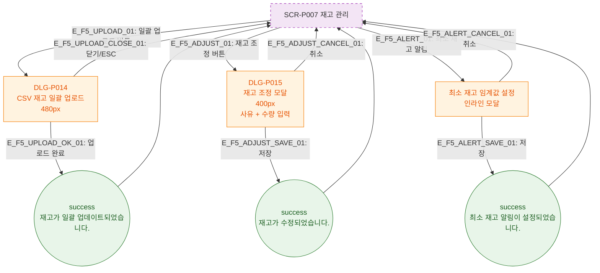

# F5 모달 트리거 트리 — SCR-P007 재고 관리 🆕

## 다이어그램

## TC 후보

| TC ID | 타입 | Given | When | Then |
|-------|------|-------|------|------|
| TC-P007-F5-01 | positive | 일괄 업로드 버튼 클릭 | 버튼 클릭 | DLG-P014 480px 모달 오픈 |
| TC-P007-F5-02 | positive | 재고 조정 버튼 클릭 | 버튼 클릭 | DLG-P015 400px 모달 오픈 |
| TC-P007-F5-03 | positive | 재고 조정 저장 | 확인 클릭 | success 토스트 "재고가 수정되었습니다." |
