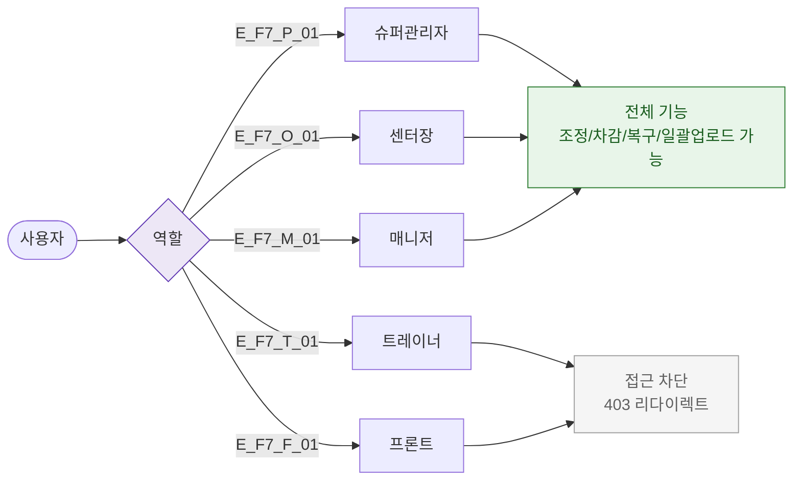

# F7 권한(RBAC) 분기 플로우 — SCR-P007 재고 관리 🆕

## 다이어그램

## TC 후보

| TC ID | 타입 | Given | When | Then |
|-------|------|-------|------|------|
| TC-P007-F7-01 | positive | manager | 재고 관리 진입 | 전체 기능 접근 가능 |
| TC-P007-F7-02 | negative | trainer | 재고 관리 메뉴 클릭 | 접근 차단, error 토스트 |
