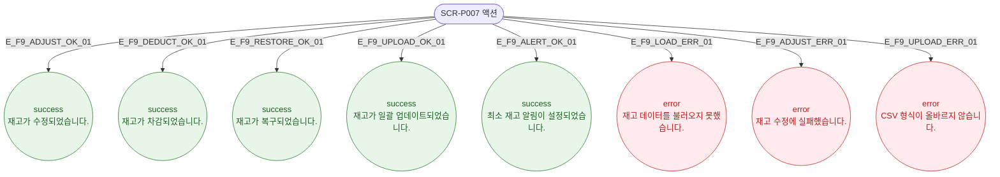

# F9 토스트/피드백 플로우 — SCR-P007 재고 관리 🆕

## 다이어그램

## TC 후보

| TC ID | 타입 | Given | When | Then |
|-------|------|-------|------|------|
| TC-P007-F9-01 | positive | 재고 조정 완료 | 저장 확인 | success 토스트 "재고가 수정되었습니다." |
| TC-P007-F9-02 | positive | 일괄 업로드 완료 | CSV 업로드 | success 토스트 "재고가 일괄 업데이트되었습니다." |
| TC-P007-F9-03 | negative | API 실패 | 페이지 진입 | error 토스트 "재고 데이터를 불러오지 못했습니다." |
