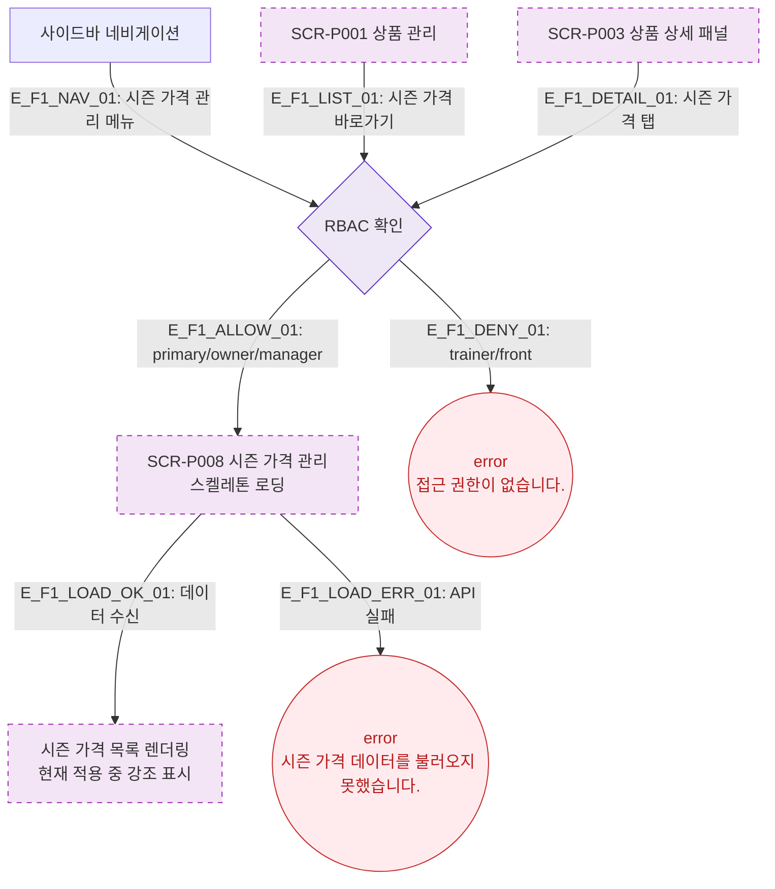

# F1 진입 플로우 — SCR-P008 시즌 가격 관리 🆕

## 목적
시즌 가격 관리 화면(SCR-P008)으로 진입하는 모든 경로와 초기 렌더링 상태를 정의한다.

## 전제조건
- 사이드바 메뉴 또는 SCR-P001/P003에서 진입
- RBAC: primary/owner/manager만 접근, trainer/front 차단
- 시즌 가격 = 특정 기간(성수기/비수기 등)에 적용되는 별도 단가 규칙

## 다이어그램

## TC 후보

| TC ID | 타입 | Given | When | Then |
|-------|------|-------|------|------|
| TC-P008-F1-01 | positive | manager | 시즌 가격 관리 메뉴 클릭 | SCR-P008 진입, 시즌 목록 표시 |
| TC-P008-F1-02 | negative | trainer | 시즌 가격 관리 메뉴 클릭 | error 토스트 "접근 권한이 없습니다." |
| TC-P008-F1-03 | negative | API 실패 | 페이지 진입 | error 토스트 "데이터를 불러오지 못했습니다." |
